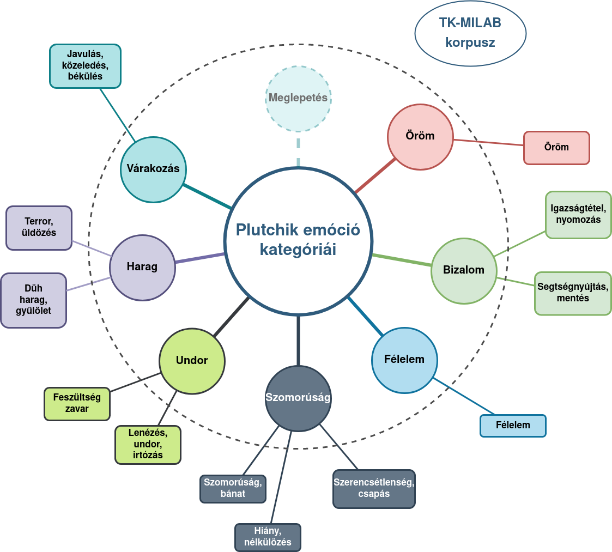
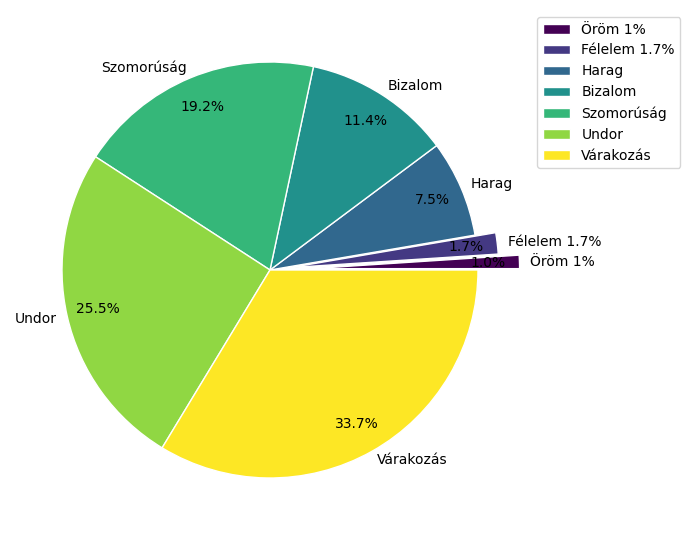
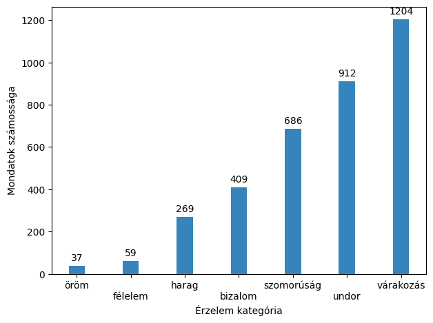
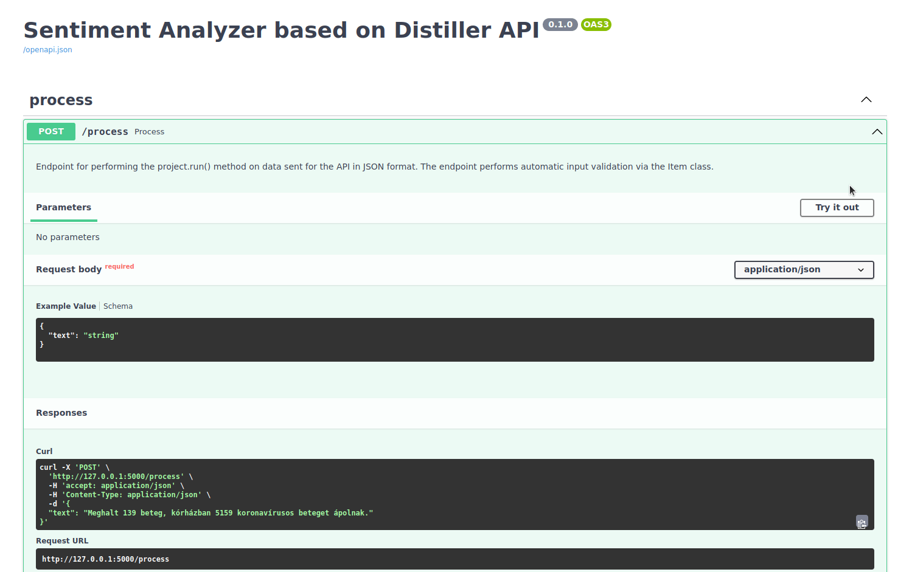

#Felhasználói kézikönyv a Distiller Sentiment Analysis API használatához


Az implementáció alapja a [MONTANA Tudásmenedzsment Kft.](https://montana.hu/) [Digital Twin Distiller](https://github.com/montana-knowledge-management/digital-twin-distiller) keretrendszere.

## Használat

Az API az adatot JSON formátumban várja, az elemzendő mondatot a "text" attribútum értékeként megadva:

```
{
  "text": "Szép napunk van."
}
```

## Háttér

Az implementációban használt Support Vector Machine (SVM) modellek a [TK-Milab](https://milab.tk.hu/hu) [Doménspecifikus szentimentelemzési-eljárás kidolgozása magyar nyelvű szövegek elemzésére](https://milab.tk.hu/domenspecifikus-szentimentelemzesi-eljaras-kidolgozasa-magyar-nyelvu-szovegek-elemzesere) projekt keretében készülő, mondat szinten kézzel címkézett korpusz első 3600 mondatán tanult.

### Alap adatok

* A kopruszt két független annotátor címkézte, majd eltérő címkék esetében egy szakértő választotta ki a végső címkét.
* A gépi tanításhoz az eredeti 5700 mondatos korpuszból csak azon mondatok lettek felhasználva, amelyek eredetileg is egyetértésben lettek annotálva a két címkéző által.
* A korpuszban az egyetértés növelése érdekében induktív kategóriarendszert (Ring et.al.2022) alkalmaztunk, amelyet a későbbiekben vezettünk vissza a Plutchik által alkalmazott 
8 elemű emóció kategória rendszer elemeire.

<br>

|                       Címkézési rendszer                        |               Az egyes címkék megoszlása (%)               |
|:---------------------------------------------------------------:|:----------------------------------------------------------:|
|  |  |

<center>

**Az egyes címkék megoszlása (db - mondat)** <br>

</center>
<br>


Tekintettel arra, hogy a korpuszban kizárólag újsághírek szerepeltek, illetve arra,
hogy a tanítás során az tanítóhalmaz elemeit egymondatos szövegek adták, 
az éles működés során is hasonló bemeneten (újsághírek egymondatos egységein) 
várható a legjobb eredmény.

### További információk:
* Emóció kategóriák: [Plutchik, 1982](https://journals.sagepub.com/doi/abs/10.1177/053901882021004003?journalCode=ssic)
* Induktív kategóriarendszer az annotálás során: [Ring et. al.2022]()
* tkmilab: [Link](https://milab.tk.hu/hu)

### Az elkészült modellek
<br>

A modelleket az eredeti emóció kategóriákra, valamint az abból aggregált pozitív/negatív szentiment osztályokra is elvégeztük. A kapott modellek megtalálhatók a projekt `resources/Multiclass_case` mappájában, alapértelmezésként az alkalmazás a pozitív/negatív címkézésre alkalmas modellt használja.

A betanítás során a SVM modell a következő eredményeket érte el emóció kategóriák szerinti bontásban:

<center>

| Emóció kategória | Pontosság | Fedés | F1 érték |
|------------------|:----------|:------|:---------|
| Harag            | 0, 45      | 0, 43  | 0, 44     |
| Várakozás        | 0, 59      | 0, 70  | 0, 64     |
| Undor            | 0, 56      | 0, 54  | 0, 55     |
| Félelem          | 1, 00      | 0, 08  | 0, 15     |
| Öröm             | 1, 00      | 0, 14  | 0, 25     |
| Szomorúság       | 0, 56      | 0, 47  | 0, 51     |
| Bizalom          | 0, 71      | 0, 74  | 0, 73     |

</center>
<br>

A korpusz kiegyensúlyozatlansága miatt a jelenleg az API-ban használt modellek a fenti kategóriákat pozitív/negatív szentiment kategóriákra aggregáltuk a következők szerint: 
* `Pozitív` címkét kapott: Várakozás, Öröm, Bizalom
* `Negatív` címkét kapott: Szomorúság, Félelem, Harag, Undor

A korpusz tartalmazott még Semleges címkéjű mondatokat is, amelyek egyszerű tényleírások, érzelmi tartalmuk az annotátorok szerint nem volt.

Az ilyen módon átalakított címkekészletre elért eredmények SVM modell használatával:

<center>

| Szentiment osztály | Pontosság | Fedés | F1 érték |
|--------------------|:----------|:------|:---------|
| Negatív            | 0,65      | 0,70  | 0,67     |
| Pozitív            | 0,58      | 0,62  | 0,60     |

</center>

## Endpoint-ok

* `/` endpoint-on érhető el ez a dokumentáció.

* `/process` endpoint, ahol az alkalmazás `single input`-ként vájra a JSON-t amelyet címkézve visszaad.

* `/apidocs` endpoint, ahol az alkalmazás OpenAPI dokumentációként leírt működése, valamint teszt interfésze található.

* `/ping` endpoint tesztelhető a szerver elérése.

## Az integrált teszt interfész használata az `/apidocs` endpoint-on


