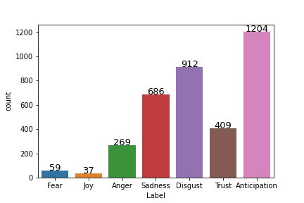

#Felhasználói kézikönyv a Distiller Sentiment Analysis API használatához


Az implementáció alapja a MONTANA Tudásmenedzsment Kft. [Docutent Distiller](https://bitbucket.org/montanatudasmenedzsmentkft/distiller) keretrendszere.

## Használat

Az API az adatot JSON formátumban várja az alábbi formátum szerint:

```
{
  "text": "Szép napunk van."
}
```

## Háttér

Az implementációban használt Support Vector Machine (SVM) modell a [TK-Milab](https://milab.tk.hu/hu) [Doménspecifikus szentimentelemzési-eljárás kidolgozása magyar nyelvű szövegek elemzésére](https://milab.tk.hu/domenspecifikus-szentimentelemzesi-eljaras-kidolgozasa-magyar-nyelvu-szovegek-elemzesere) projekt keretében készülő, mondat szinten kézzel annotált korpusz első 3600 mondatán lett tanítva.

A kopruszt két független annotátor címkézte, majd egy szakértő validálta. A címkék megoszlása a validált adathalmazban: 



Tekintettel arra, hogy a korpuszban kizárólag újsághírek szerepeltek, illetve arra,
hogy a tanítás során az tanítóhalmaz elemeit egymondatos szövegek adták, 
az éles működés során is hasonló bemeneten (újsághírek egymondatos egységein) 
várható a legjobb eredmény.

A betanítás során a SVM modell a következő legjobb eredményeket érte el:

|category|precision              | recall           |f1-score|
|-----------|:---------------------|:----------------|:--------|
|Anger|0.45|0.43|0.44|
Anticipation|0.59|0.70|0.64|
|Disgust|0.56|0.54|0.55|
|Fear|1.00|0.08|0.15|
|Joy|1.00|0.14|0.25|
|Sadness|0.56|0.47|0.51|
|Trust|0.71|0.74|0.73|
| | | | |
|accuracy| | |0.58|
|macro avg|0.70|0.44|0.47|
|weighted avg|0.59|0.58|0.57|


## Endpoint-ok

* `/` endpoint-on érhető el ez a dokumentáció.

* `/process` endpoint, ahol az alkalmazás `single input`-ként vájra a JSON-t amelyet címkézve visszaad.

* `/apidocs` endpoint, ahol az alkalmazás OpenAPI dokumentációként leírt működése, valamint teszt interfésze található.

* `/ping` endpoint tesztelhető a szerver elérése.

## Az integrált teszt interfész használata az `/apidocs` endpoint-on


